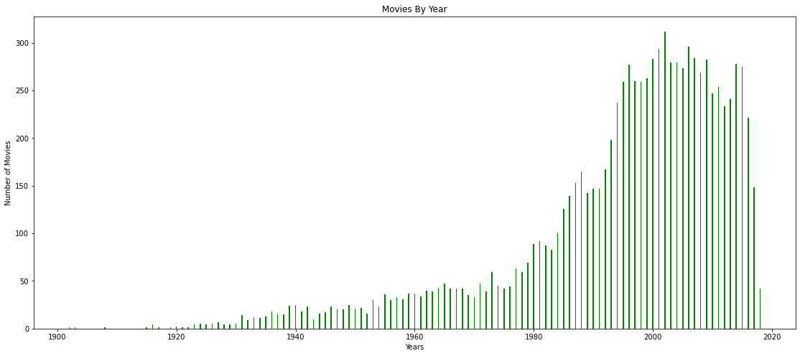

# Netflix New User Movie Reccomendation System

## Overview

Flatiron School Data Science Phase 4 project Reccomendation Systems.  The goal is to produce 5 reccomendations based on user's ratings of movies.

This project is for educational purposes and Netflix has no actual affiliation with the producer or the results.

## Business Problem

Netflix is looking to improve their recomendation system for new users.  As part of a new trial membership program Netflix is looking to maximize their customer retention by providing the best possible recomendations.  It is important that this new recomendation system will also improve recomendations for existing customers.

## Data Used

data from MovieLens can be found in the 'data' folder
* movies.csv
* ratings.csv
* tags.csv
* links.csv

movies.csv and ratings.csv were used to create the model and make predictions 

Movie rating distribution can be seen below.

Movies used by year

## Final Model

The final model was a Singular Value Decomposition(SVD) using surprise library.  The model was hyper-tuned using the following parameters.

## Model Evaluation
the metric used to evaluate the models was root-mean-square error (RMSE).  Our best model had an RMSE of about .860.

## Sample Predictions

Movie predictions from model. The top 5 rated movies.

Filtered movie predictions.  The top 5 rated movies after results have been fileterd by user survey.

## Limitations

Our model will only be as good as our data.  We should anticipate and expect improved metrics as our data increases.  

## Recommendations and Next Steps

* Develop plan to encourage users to rate more movies.  
* Create new models using user login demographics.
* Use Natural Language Processing(NLP) on movie scripts to gain more insight on our users preferences.

## Conclusion

After a thorough iterative modeling process, we determined that the hypertuned svd model would be the best selection at this point.  Reccomendations would be made for the new trial users based on their initial reccomendation and the optional survey that limits the years of release and the genres of the recommendations.

## Deliverables
* [Non-Technical Presentation]()
* [GitHub Repository](https://github.com/ceflynn/Movie-Recommendation-System)
* [Jupyter Notebook](https://github.com/ceflynn/Movie-Recommendation-System/blob/main/student.ipynb)

